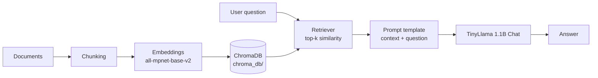

# Local RAG System (LangChain + ChromaDB + TinyLlama)

A fully local Retrieval-Augmented Generation (RAG) pipeline. It ingests your documents, stores them as embeddings in a persistent ChromaDB vector store, and answers questions in the terminal using **only** the retrieved context, with no external API calls required.

## How It Works

The project has two parts:

| File | Role |
|---|---|
| `storage.py` | **Ingestion.** Loads documents from a given path, splits them into chunks, creates embeddings, and saves them to a persistent Chroma directory (`chroma_db`). |
| `main.py` | **Question answering.** Loads the vector store, retrieves the most relevant chunk for a query, builds a prompt, and generates an answer with a local Hugging Face model. |



1. **Ingest (`storage.py`)**: documents → chunks → embeddings → saved in `chroma_db/`.
2. **Retrieve (`main.py`)**: the user's question is embedded and the most similar chunk(s) are fetched from Chroma.
3. **Generate (`main.py`)**: the retrieved context and the question are inserted into a prompt, and TinyLlama produces the answer.
4. If the answer is not in the context, the model is instructed to reply: *"I could not find the answer in the document."*

## Tech Stack

- **Orchestration:** LangChain
- **Vector store:** ChromaDB (persistent, local)
- **Embeddings:** `sentence-transformers/all-mpnet-base-v2` (normalized)
- **LLM:** `TinyLlama/TinyLlama-1.1B-Chat-v1.0` via Hugging Face `transformers`
- **Config:** `python-dotenv`

## Project Structure

```text
.
├── storage.py          # Ingestion: load -> chunk -> embed -> persist
├── main.py             # Query loop: retrieve -> prompt -> generate
├── requirements.txt
├── .env                # Optional environment variables
├── chroma_db/          # Created by storage.py (persisted vector store)
└── README.md
```

## Installation

**Requirements:** Python 3.10+ (a GPU is optional; CPU works but is slower).

```bash
# 1. Clone the repository
git clone https://github.com/tejes2005/Local-RAG-System.git
cd <your-repo>

# 2. (Recommended) create a virtual environment
python -m venv venv
source venv/bin/activate        # Windows: venv\Scripts\activate

# 3. Install dependencies
pip install -r requirements.txt
```

Minimal `requirements.txt` for this project:

```text
python-dotenv
langchain-core
langchain-huggingface
langchain-chroma
chromadb
sentence-transformers
transformers
torch
```

Add `langchain-community`, `langchain-text-splitters`, and a loader package such as `pypdf` if your `storage.py` uses them for loading and splitting documents.

> **CPU-only machines:** install a smaller PyTorch build first:
> `pip install torch --index-url https://download.pytorch.org/whl/cpu`

## Usage

### Step 1: Build the vector store

Run the ingestion script on your documents. This reads them from the path you provide, chunks them, embeds them, and creates the `chroma_db/` directory.

```bash
python storage.py
```

> Update the document path inside `storage.py` (or pass it as an argument if your script supports one) to point at your files.

### Step 2: Ask questions

```bash
python main.py
```

```text
RAG System
0 to Exit
you: what is prompt

 AI: A prompt is a structured template that guides the model towards producing reliable and relevant outputs.
```

Type `0` to exit.

## Configuration

Key settings live in `main.py`:

| Setting | Default | Description |
|---|---|---|
| `model_name` (embeddings) | `all-mpnet-base-v2` | Must match the model used in `storage.py` |
| `persist_directory` | `chroma_db` | Location of the vector store |
| `search_kwargs["k"]` | `1` | Number of chunks retrieved per query |
| `max_new_tokens` | `200` | Maximum length of the generated answer |
| `temperature` | `0.2` | Lower values give more deterministic answers |
| `repetition_penalty` | `1.1` | Reduces repeated phrases |

> **Important:** the embedding model in `main.py` must be the **same** one used in `storage.py`. Mixing models makes retrieval meaningless.

## Troubleshooting

**The model invents extra `Human:` / `AI:` turns or prints the system prompt.**
Use `ChatHuggingFace` (so TinyLlama's chat template is applied) and set `return_full_text=False` in the pipeline arguments. Both are already configured in `main.py`.

**Warning: `max_new_tokens` and `max_length` both set.**
Harmless. Setting `"max_length": None` in `pipeline_kwargs` removes it.

**Warning about `clean_up_tokenization_spaces`.**
Harmless. Pass `"clean_up_tokenization_spaces": False` in `pipeline_kwargs`.

**`ModuleNotFoundError: No module named 'langchain_chroma'`**
Run `pip install langchain-chroma`.

**Answers are poor or ignore the context.**
A 1.1B model follows instructions loosely. Increase `k`, tune your chunk size in `storage.py`, or switch to a stronger instruct model such as `Qwen/Qwen2.5-1.5B-Instruct` or `microsoft/Phi-3-mini-4k-instruct`.

## Limitations

- TinyLlama is small and can still hallucinate or ignore the "use only the context" instruction.
- No conversation memory: each question is answered independently.
- Retrieval uses plain similarity search with a single chunk by default.
- Since the model runs locally, it may take some time to generate an answer.
- The system currently runs only in the terminal, not through a graphical interface.

